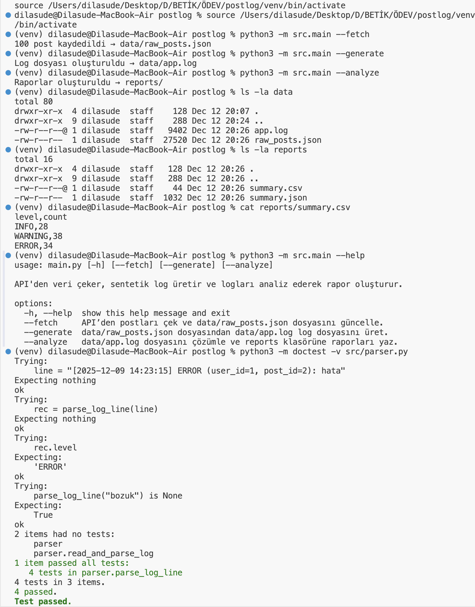

## Log Analiz Uygulaması

## Projenin Amacı

Bu projenin amacı, bir API üzerinden alınan verilerle sentetik bir log dosyası oluşturmak ve bu logları analiz ederek istatistiksel raporlar üretmektir.

Uygulama şu işlemleri gerçekleştirir:

-API’den post verilerini alır.
-Her post için rastgele log seviyesinde (INFO, WARNING, ERROR) log
satırları üretir.
-Log satırlarını regex kullanarak çözümler.
-Analiz sonucunda CSV ve JSON formatında raporlar oluşturur.

## Kurulum Adımları

1) Proje klasörüne girilir:
cd postlog

2) Sanal ortam oluşturulur ve aktif edilir:
python3 -m venv venv
source venv/bin/activate

3) Gerekli paketler yüklenir:
pip install -r requirements.txt

## Örnek Komutlar

1) API’den veri çekme:
python3 -m src.main --fetch

2) Log dosyası üretme:
python3 -m src.main --generate

3) Log analizi ve rapor üretme:
python3 -m src.main --analyze

## Ekran Görüntüsü Anlatımı

1) python3 -m src.main --fetch bu komut ile API’den (veya internet erişimi yoksa offline olarak) post verileri alınmış ve
data/raw_posts.json dosyası başarıyla oluşturulmuştur.

2) python3 -m src.main --generate komutu çalıştırılmış ve alınan post verilerinden sentetik log satırları üretilerek
data/app.log dosyası oluşturulmuştur.

3) python3 -m src.main --analyze omutu çalıştırılmış, log dosyası analiz edilmiş ve analiz sonuçları
reports/summary.csv ve reports/summary.json dosyalarına yazılmıştır.

4) ls -la data ve ls -la reports komutları ile:
raw_posts.json
app.log
summary.csv
summary.json
dosyalarının başarıyla oluşturulduğu gösterilmiştir.

5) cat reports/summary.csv komutu ile seviye bazlı log sayıları terminalde görüntülenmiştir.

6) python3 -m src.main --help komutu ile komut satırı arayüzünün yardım çıktısı gösterilmiş ve programın kullanıcıya açıklayıcı bilgiler sunduğu doğrulanmıştır.

7) Son olarak python3 -m doctest -v src/parser.py komutu çalıştırılmış ve log satırı çözümleme fonksiyonu için yazılan testlerin tamamının başarıyla geçtiği gösterilmiştir.